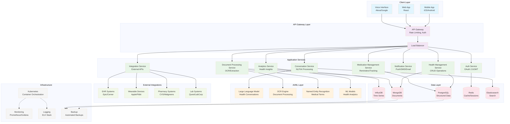

# Health Buddy AI Agent

A revolutionary personal health management platform that serves as an intelligent companion for users' health journeys, providing AI-powered insights, comprehensive health tracking, and seamless healthcare ecosystem integration.

## 🌐 Live Documentation Website

**Visit the complete documentation website:** [https://azcprbju.manus.space](https://azcprbju.manus.space)

## 📋 Project Overview

Health Buddy AI Agent addresses the critical need for personalized, continuous health management by providing an AI-powered platform that can understand, track, and assist with all aspects of personal health. The platform serves as the central hub for health-related activities, from medication management and symptom tracking to healthcare provider communication and predictive health analytics.

## 🎯 Key Features

- **AI-Powered Health Assistant**: Advanced conversational AI with medical knowledge
- **Comprehensive Health Management**: Complete health profile and timeline tracking
- **Healthcare-Grade Security**: HIPAA-compliant with end-to-end encryption
- **Predictive Health Analytics**: Machine learning for risk assessment and recommendations
- **Healthcare Ecosystem Integration**: EHR, wearables, pharmacies, and laboratories
- **Personalized Insights**: Tailored recommendations based on individual profiles

## 📚 Documentation

This repository contains comprehensive documentation for the Health Buddy AI Agent platform:

### Core Documents

| Document | Description | Markdown | PDF |
|----------|-------------|----------|-----|
| **Complete Overview** | Executive summary and guide to all documents | [📄](docs/markdown/health_buddy_overview.md) | [📑](docs/pdf/health_buddy_overview.pdf) |
| **Product Requirements (PRD)** | Product vision, market analysis, and requirements | [📄](docs/markdown/health_buddy_prd.md) | [📑](docs/pdf/health_buddy_prd.pdf) |
| **Functional Requirements (FRD)** | Detailed technical specifications | [📄](docs/markdown/health_buddy_frd.md) | [📑](docs/pdf/health_buddy_frd.pdf) |
| **System Architecture** | Technical design and architecture | [📄](docs/markdown/health_buddy_architecture.md) | [📑](docs/pdf/health_buddy_architecture.pdf) |
| **Project Plan & Prompts** | 24-week development plan with weekly prompts | [📄](docs/markdown/health_buddy_project_plan.md) | [📑](docs/pdf/health_buddy_project_plan.pdf) |

### System Architecture

## 🚀 Development Timeline

The project is structured in **4 phases over 24 weeks**:

### Phase 1: Foundation & Core Features (Weeks 1-6)
- Infrastructure setup and user authentication
- Basic health data management and document processing
- Conversational AI foundation and medication management

### Phase 2: Advanced AI & Analytics (Weeks 7-12)
- Enhanced natural language processing
- Health analytics and predictive modeling
- Personalized recommendations and intelligent monitoring

### Phase 3: Healthcare Integration (Weeks 13-18)
- EHR system integration and wearable device connectivity
- Pharmacy and laboratory system integration
- Healthcare provider communication platform

### Phase 4: Advanced Features & Launch (Weeks 19-24)
- Family health management and research participation
- International expansion and performance optimization
- Launch preparation and deployment

## 📋 Weekly Development Prompts

Each week includes detailed development prompts with:
- **Specific objectives** and deliverables
- **Technical requirements** and acceptance criteria
- **Implementation guidance** and best practices
- **Success metrics** and validation steps

See the [Project Plan document](docs/markdown/health_buddy_project_plan.md) for complete weekly prompts.

## 🛠 Technology Stack

### Backend
- **Framework**: Python, FastAPI, SQLAlchemy
- **AI/ML**: Transformers, spaCy, TensorFlow, scikit-learn
- **Databases**: PostgreSQL, MongoDB, InfluxDB, Redis
- **Search**: Elasticsearch with full-text search

### Frontend
- **Framework**: React, TypeScript, Material-UI
- **State Management**: Redux with RTK Query
- **Mobile**: React Native for cross-platform apps

### Infrastructure
- **Cloud Platform**: AWS with multi-region deployment
- **Orchestration**: Kubernetes with EKS
- **Monitoring**: Prometheus, Grafana, ELK Stack
- **Security**: End-to-end encryption, HIPAA compliance

## 🔒 Security & Compliance

- **HIPAA Compliance**: Healthcare data protection standards
- **GDPR Compliance**: European data protection regulations
- **SOC 2 Type II**: Security and availability controls
- **End-to-End Encryption**: All data encrypted in transit and at rest
- **Zero-Trust Architecture**: Comprehensive security model

## 📊 Project Statistics

- **15+ Core Features** comprehensively documented
- **24-Week Development Timeline** with detailed weekly prompts
- **4 Development Phases** with clear milestones and deliverables
- **100% HIPAA Compliant** architecture and implementation
- **Scalable to Millions** of users with cloud-native design

## 🚀 Getting Started

1. **Review Documentation**: Start with the [Complete Overview](docs/markdown/health_buddy_overview.md)
2. **Understand Requirements**: Read the [PRD](docs/markdown/health_buddy_prd.md) and [FRD](docs/markdown/health_buddy_frd.md)
3. **Study Architecture**: Review the [System Architecture](docs/markdown/health_buddy_architecture.md)
4. **Follow Development Plan**: Use the [24-Week Project Plan](docs/markdown/health_buddy_project_plan.md)
5. **Begin Implementation**: Start with Week 1 development prompts

## 📞 Support

For questions about the Health Buddy AI Agent project:
- Review the comprehensive documentation in the `docs/` directory
- Visit the [live documentation website](https://azcprbju.manus.space)
- Check the weekly development prompts for implementation guidance

## 📄 License

This project documentation is provided for development and implementation purposes.

---

**Created by Manus AI** | **Version 1.0** | **June 2025**

*Revolutionizing personal health management through intelligent AI assistance and comprehensive healthcare integration.*

